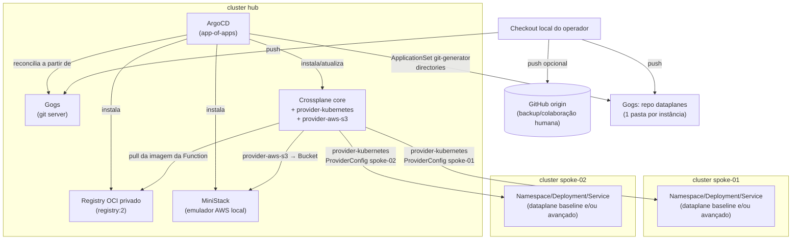

# Arquitetura

Este documento descreve a topologia atual do lab: os três clusters k3d, a árvore
app-of-apps do ArgoCD, o papel do Crossplane no modelo hub-and-spoke, o Gogs como
única fonte GitOps, o registry OCI privado e o emulador de AWS (MiniStack). Tudo aqui
reflete o estado real dos manifests em `gitops/`, `crossplane/`, `compositions/`,
`registry/` e `ministack/` — não um design aspiracional.

## Visão geral: 3 clusters, 1 rede Docker

```
hub, spoke-01, spoke-02 — três clusters k3d na mesma rede Docker "hublab"
```

- **`hub`**: o único cluster que roda ArgoCD, Gogs e o control plane do Crossplane
  (core + providers). É o único ponto de controle da plataforma (Constitution
  Principle II — Hub-and-Spoke Isolation).
- **`spoke-01` / `spoke-02`**: não rodam nenhuma ferramenta de plataforma. Apenas
  recebem recursos provisionados a partir do hub via `provider-kubernetes`
  (`kubernetes.crossplane.io/v1alpha2` `Object`).

Cada spoke é registrado no hub como um `ProviderConfig` (`crossplane/config/`)
apontando para um `Secret` com o kubeconfig do spoke, criado fora do Git
(Constitution Principle V — Secrets Never Committed). Compositions selecionam o
spoke alvo exclusivamente por `spec.parameters.spoke` → `providerConfigRef.name`,
nunca por endpoint/credencial embutidos.

Cada spoke também é registrado **no ArgoCD** como um Cluster (Secret com label
`argocd.argoproj.io/secret-type: cluster` no namespace `argocd`, criado por
`scripts/16-register-argocd-clusters.sh` a partir do mesmo kubeconfig usado
pelo `ProviderConfig`). Isso faz `spoke-01`/`spoke-02` aparecerem em
Settings > Clusters na UI do ArgoCD, ao lado do `in-cluster` (o próprio hub).
Hoje isso é só visibilidade/topologia — nenhuma `Application` do ArgoCD tem
`destination.server` apontando para um spoke; o provisionamento continua
inteiramente via Crossplane/`provider-kubernetes`. Ver ADR-027 em
`decisions.md`.

## Diagrama de componentes



Observação: o diagrama mostra apenas o que existe hoje nos manifests
(`gitops/apps/*.yaml`, `ministack/`, `registry/`). MiniStack é um componente recente
(commit `868d5ee`) que substitui/complementa qualquer necessidade de AWS real —
não há outro emulador AWS no repositório no momento.

## App-of-apps: da raiz aos componentes

A única `Application` aplicada manualmente é `gitops/root/app-of-apps.yaml`
(root-app-of-apps), que aponta para o diretório `gitops/apps/` (fonte `directory`,
com `exclude` para só considerar arquivos `.yaml`/`.yml` — isso evita que
subpastas não-Application quebrem a descoberta). Toda `Application`/`ApplicationSet`
filha vive nesse diretório e é descoberta automaticamente.

Filhas atuais, por `sync-wave` (menor primeiro):

| sync-wave | Application/ApplicationSet | Fonte | Namespace destino |
|---|---|---|---|
| `"0"` | `gogs` | `bootstrap/gogs` (directory) | `gogs` |
| `"0"` | `crossplane` | Helm chart oficial `charts.crossplane.io/stable` v1.20.13 | `crossplane-system` |
| `"0"` | `registry` | `registry/` (directory) | `registry` |
| `"0"` | `ministack` | `ministack/` (directory) | `ministack` |
| `"1"` | `crossplane-providers` | `crossplane/providers` (directory) | `crossplane-system` |
| `"1"` | `crossplane-compositions` | `compositions/dataplane-baseline/chart` (helm) | `crossplane-system` |
| `"1"` | `crossplane-compositions-advanced` | `compositions/dataplane-advanced/chart` (helm) | `crossplane-system` |
| `"1"` | `crossplane-compositions-s3` | `compositions/s3-bucket/chart` (helm) | `crossplane-system` |
| `"2"` | `crossplane-config` | `crossplane/config` (directory) | `crossplane-system` |
| `"2"` | `argocd-networking` | `gitops/argocd` (directory) | `argocd` |
| `"2"` | `dataplanes` (ApplicationSet) | git generator `directories` sobre o repo `dataplanes` | `default` (por Application gerada) |

**Por que essa ordem:** Crossplane core precisa existir antes de qualquer
`Provider`/`ProviderConfig`/`Composition` que o referencie (wave 0 → 1); o
registry e o MiniStack também sobem na wave 0 porque as Compositions da wave 1
dependem deles ficarem prontos primeiro (a Function precisa da imagem já
publicável no registry; o `ProviderConfig ministack` referencia o MiniStack pelo
hostname do Service). `ProviderConfig`s (wave 2) só fazem sentido depois que o
`provider-kubernetes`/`provider-aws-s3` (wave 1, dentro de `crossplane-providers`)
já está instalado e healthy. O `ApplicationSet` de dataplanes (wave 2) só
funciona depois que a Composition avançada (wave 1) já registrou a XRD
`XDataPlaneAdvanced` no cluster. Todas as filhas usam
`syncPolicy.automated.{prune,selfHeal}: true` e `CreateNamespace=true`
(Constitution Principle III), então a árvore inteira se autocorrige sem
intervenção manual.

## Papel do Crossplane (hub-and-spoke)

O Crossplane roda **somente no hub**. Ele expõe XRDs/Compositions que, quando
reivindicadas via `claim`, produzem recursos `kubernetes.crossplane.io/v1alpha2`
`Object` — manifests brutos aplicados em um spoke via `provider-kubernetes`,
usando o `ProviderConfig` cujo nome bate com `spec.parameters.spoke`. O
Crossplane nunca fala diretamente com a API do spoke fora desse provider; ele
também não instala nada no spoke além dos recursos que a Composition descreve
(Namespace/ConfigMap/Deployment/Service, ou um Bucket via `provider-aws-s3`
contra o MiniStack).

Três Compositions existem hoje (ver `docs/compositions.md` para detalhes de cada
uma):
1. `dataplane-baseline` — Patch-and-Transform clássico, produz recursos em um spoke.
2. `dataplane-advanced` — Composition Function em Go (`spec.mode: Pipeline`),
   produz um conjunto mais rico de recursos em um spoke.
3. `s3-bucket` — Patch-and-Transform, provisiona um Bucket `provider-aws-s3` no
   MiniStack (não em um spoke k3d — é o único caso onde o alvo não é um dos clusters
   spoke, e sim o emulador AWS rodando no hub).

## Gogs como única fonte GitOps

ArgoCD reconcilia **exclusivamente** a partir do Gogs interno
(`http://gogs.gogs.svc.cluster.local:3000/...`), nunca do GitHub. Um remote
`origin` (GitHub) pode existir para colaboração/backup humano, mas o ArgoCD
nunca aponta para ele (Constitution: Development Workflow / Technology
Constraints). Isso mantém o lab funcional sem acesso à rede externa após o
bootstrap inicial.

Há dois repositórios Gogs relevantes:
- **`platform`** (este repositório) — tudo que ArgoCD instala diretamente:
  charts das Compositions, manifests do registry/MiniStack, Applications,
  ApplicationSet.
- **`dataplanes`** — repositório separado, só com uma pasta por instância de
  dataplane avançado (`values.yaml` cada). É consumido pelo `ApplicationSet`
  via git generator `directories`.

O código-fonte da Composition Function (Go) **não** vive em um terceiro
repositório dedicado — a ideia original (feature 002, ver `research.md`) era
um repo `dataplane-function` separado, mas isso foi revertido durante a
implementação (ver `docs/decisions.md`) e o código ficou em
`compositions/dataplane-advanced/function/` dentro deste mesmo repositório.

## Registry OCI privado

`registry/` sobe um `registry:2` (CNCF distribution/distribution) como
Deployment+PVC+Service+Ingress no hub, dedicado a publicar a imagem xpkg da
Composition Function. Pontos que fogem do "Deployment simples":
- **TLS é terminado pelo próprio pod do registry** (`REGISTRY_HTTP_TLS_*`),
  não pelo Ingress — o cliente `crossplane xpkg push`/pull do Crossplane exige
  HTTPS verificável na origem.
- **Service com ClusterIP fixo** (`10.43.0.50`, ver `registry/service.yaml`) —
  necessário porque o containerd do node não resolve `*.svc.cluster.local`
  (isso só resolve dentro do namespace de rede de um pod, via CoreDNS).
- **Exposto via `IngressRoute` do Traefik**, não `Ingress` puro — o provider
  Kubernetes-Ingress do Traefik v3 não respeitava o `scheme: https` do backend
  de forma confiável nos testes desta feature.
- Acesso externo: `https://registry.127-0-0-1.nip.io` (push manual pelo
  operador). Acesso interno (pull pelo cluster): via mirror de containerd
  configurado por `scripts/12-configure-hub-registry-mirror.sh`, que redireciona
  `registry.registry.svc.cluster.local:5000` para o ClusterIP fixo — ver
  `docs/decisions.md` para o porquê.

## MiniStack (emulador AWS local)

`ministack/` sobe o MiniStack (`ministack.org`, compatível com a API do LocalStack) como
Deployment+Service+PVC+Ingress no hub, mais um console web (`stackport`,
Deployment+Service próprios). É consumido pelo `provider-aws-s3` (Upbound,
v1.14.0) através do `ProviderConfig ministack`
(`crossplane/config/providerconfig-ministack.yaml`), que aponta para
`http://ministack.ministack.svc.cluster.local:4566` com credenciais falsas
(`skip_credentials_validation: true`, convenção universal de emuladores
estilo LocalStack). É o único componente do lab cujo alvo de provisionamento
não é um cluster spoke k3d.

Ambos os Deployments do MiniStack/StackPort levam `enableServiceLinks: false`
por precaução — o Floci (emulador anterior, ver ADR-025/ADR-026 em
`docs/decisions.md`) crashava de verdade porque o Kubernetes auto-injetava
`FLOCI_PORT=tcp://<ip>:4566` a partir do Service, colidindo com a própria
variável de config `FLOCI_PORT` do Floci. O MiniStack documenta `GATEWAY_PORT`
(não `MINISTACK_PORT`) como sua variável de porta, então o mesmo colisão não
foi confirmada — a flag ficou como precaução barata, não como correção de um
bug observado no MiniStack.
